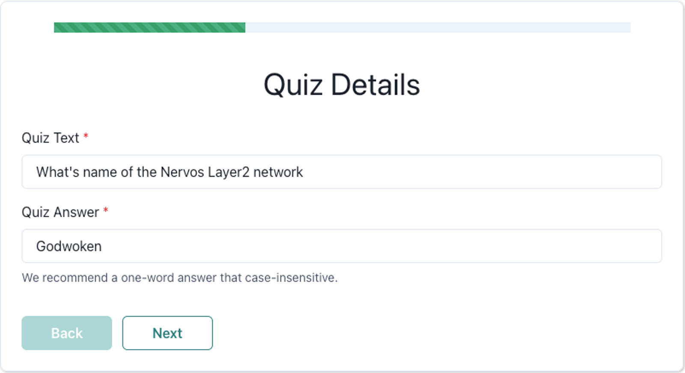

# CKQuiz APP

CKQuiz-app 是 CKQuiz的Create界面，通过web界面简化用户创建CKQuiz插件的过程。

 

# Table of contents

- [Usage](#usage)
- [Contributing](#contributing)
- [License](#license)

# Usage

[(Back to top)](#table-of-contents)

注册界面的[使用文档](https://liriu.notion.site/QuickStart-Chinese-Version-158e8af4c20e4f1387f99c1a6656eea6)

# Contributing

[(Back to top)](#table-of-contents)

欢迎贡献代码

在项目目录下输入 `npm run start` 即可启动开发环境。

# License

[(Back to top)](#table-of-contents)

The MIT License (MIT) 2017 - [LiRiu](https://github.com/liriu/). Please have a look at the [LICENSE.md](LICENSE.md) for more details.